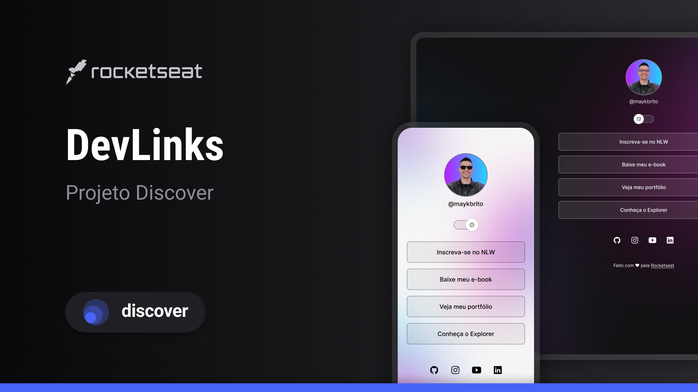

# Link-tree

Este é um projeto simples de uma página de links, inspirado no conceito de "**Linktree**". Ele permite que você centralize e compartilhe vários links em um único lugar.

## Funcionalidades

- Adicione múltiplos links com títulos personalizados.

- Design responsivo para dispositivos móveis.

- Fácil personalização de estilos.

## Tecnologias Utilizadas

- **HTML5**: Estrutura da página.

- **CSS3**: Estilização e layout.

- **JavaScript**: Funcionalidades interativas (se aplicável).

## Como Usar

1. Clone este repositório:

```bash

git clone https://github.com/seu-usuario/Link-tree.git

```

2. Navegue até o diretório do projeto:

```bash

cd Link-tree

```

3. Abra o arquivo `index.html` no navegador.

## Personalização

- Edite o arquivo `index.html` para adicionar ou modificar os links.

- Ajuste o estilo no arquivo `style.css` conforme necessário.

## Prévia

<p align= "center">
 
</p>

## Licença

Este projeto está licenciado sob a [MIT License](LICENSE).

---

Feito com ❤️ por Clara.
